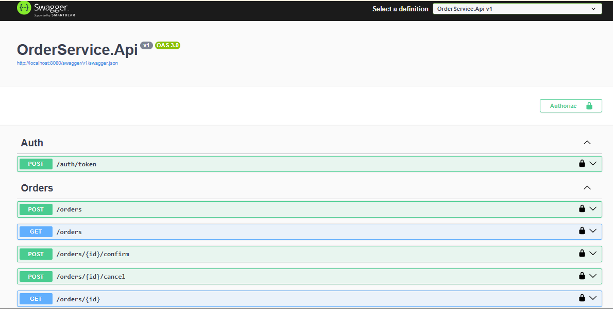

# Microservice Order Service API NSTech

O projeto consiste em uma API REST para gestão de pedidos, construída com foco em Clean Architecture, Domain-Driven Design (DDD) e boas práticas de engenharia de software.

> 🧠 **Decisões Técnicas e Arquitetura**
> Para ler sobre as justificativas de arquitetura, padrões utilizados (CQRS, Repository), modelagem de domínio, estratégia de testes e observabilidade, por favor, acesse o nosso Registro de Decisões:
> [👉 Clique aqui para ler o /docs/decisions.md](./docs/decisions.md)

---

## 🚀 Tecnologias Utilizadas

*   **.NET 8** (Web API)
*   **C# 12**
*   **PostgreSQL** (Produção/Docker) & **SQLite In-Memory** (Testes de Integração)
*   **Entity Framework Core 8** (Code-First / Migrations Automáticas)
*   **MediatR** (Padrão CQRS & Pipeline Behaviors)
*   **JWT Bearer** (Autenticação e Autorização)
*   **xUnit, Moq & FluentAssertions** (Testes Unitários e E2E)
*   **Docker & Docker Compose** (Multi-stage build)

---

## ⚙️ Como Executar o Projeto (Docker)

O projeto foi configurado para rodar de forma simples e direta utilizando containers, garantindo que o banco de dados e a API subam perfeitamente orquestrados. 

### Pré-requisitos
*   [Docker Desktop](https://www.docker.com/products/docker-desktop) instalado e rodando.

### Passos

1. Clone este repositório:
   ```bash
   git clone https://github.com/leoaidar/nstech-prova.git
   cd nstech-prova
   ```

2. Suba os containers em background:
   ```bash
   docker-compose up -d --build
   ```

3. Acesse a documentação interativa da API (Swagger) no seu navegador:
   * 👉 **http://localhost:8080/swagger**

*(Nota: O banco de dados Postgres subirá e a aplicação aplicará as migrations de tabela automaticamente no start).*

---

## 🔒 Autenticação e Uso da API

A API é protegida por **JWT (JSON Web Token)**. Para realizar chamadas nos endpoints de pedidos, siga os passos no Swagger:

1. Utilize o endpoint `POST /auth/token` para gerar um token de acesso válido.
2. Copie o token retornado na resposta.
3. Clique no botão **"Authorize"** (cadeado verde) no topo da página do Swagger.
4. Digite `Bearer [seu_token]` e clique em Authorize.
5. Agora você está autenticado e pode testar o fluxo completo de pedidos (`Orders`)!

---

## 🧪 Como Executar os Testes

A solução possui uma suíte robusta cobrindo os caminhos felizes, exceções de domínio e testes End-to-End (E2E) dos endpoints usando o `WebApplicationFactory`.

Para rodar todos os testes localmente via terminal (não é necessário subir o Docker para os testes, pois a infraestrutura E2E utiliza SQLite em memória):

```bash
dotnet test
```

---

## 🩺 Observabilidade e Monitoramento

*   **Logging Global:** Todas as requisições passam por um *Pipeline Behavior* do MediatR, gerando logs automáticos de tempo de execução (Stopwatch), sucesso e tratamento de exceções de maneira centralizada no console.
*   **Health Check:** A saúde da aplicação e a conectividade em tempo real com o banco de dados podem ser validadas por orquestradores (ex: Liveness Probes do Kubernetes) acessando a rota exclusiva para infraestrutura:
   * 👉 **http://localhost:8080/health**

### 📸 Visão Geral da API (Swagger)

Abaixo, a interface interativa gerada automaticamente onde você pode testar todos os fluxos descritos:



## 💡 Exemplo de Consumo e Data Seed

Para facilitar o teste de criação de pedidos sem a necessidade de popular o banco de dados manualmente, a aplicação executa um **Data Seed** automático durante a subida do container, inserindo produtos padrão no estoque.

Você pode utilizar o payload abaixo diretamente no Swagger (`POST /orders`) utilizando os IDs dos produtos pré-cadastrados:

```json
{
  "customerId": "3fa85f64-5717-4562-b3fc-2c963f66afa6",
  "currency": "BRL",
  "items": [
    {
      "productId": "11111111-1111-1111-1111-111111111111",
      "quantity": 1
    },
    {
      "productId": "22222222-2222-2222-2222-222222222222",
      "quantity": 2
    },
    {
      "productId": "33333333-3333-3333-3333-333333333333",
      "quantity": 3
    }
  ]
}
```
